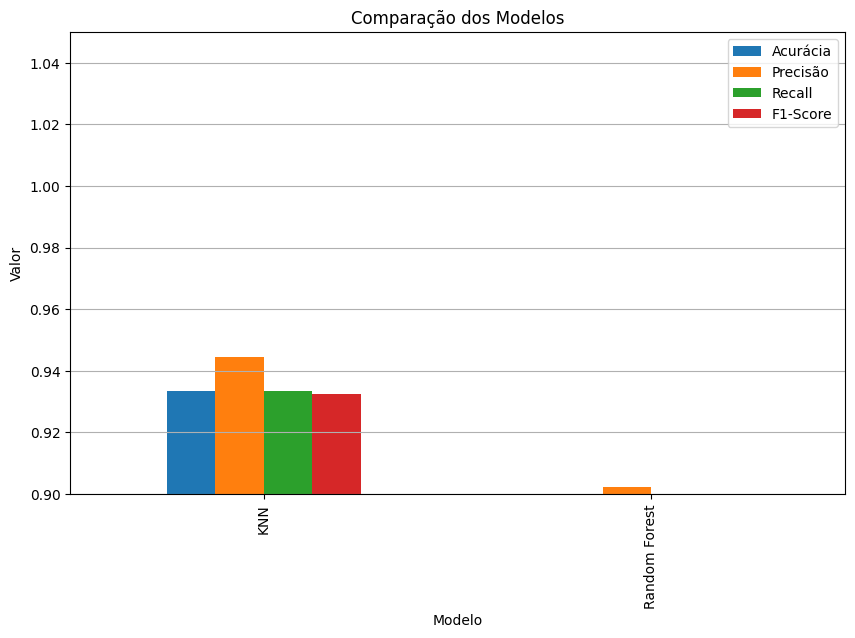
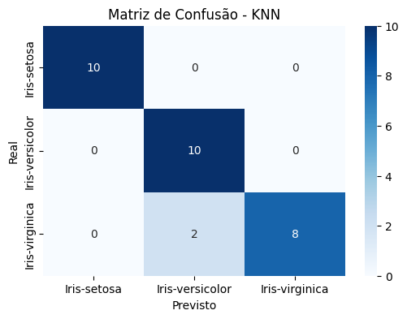
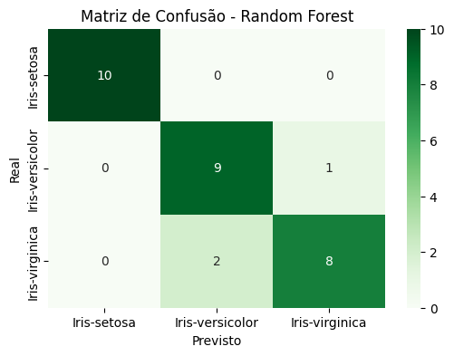

Disciplina de Inteligência Artificial , Professor Munif , Unicesumar 2026

# Trabalho Final de Inteligência Artificial

## Classificação de Espécies de Flores Iris com KNN e Random Forest

## Integrantes

Luigi Biagio Antonioli RA: 23329385-2
Francisco Guilherme Soares dos Santos - RA: 23389027-2

---

## Resumo do projeto

Este projeto foi desenvolvido como trabalho final da disciplina de Inteligência Artificial, com o objetivo de aplicar na prática os conceitos de aprendizado de máquina.

O tema escolhido foi a **classificação de espécies de flores Iris** utilizando dois modelos supervisionados de Inteligência Artificial:

* KNN — K-Nearest Neighbors.
* Random Forest.

O projeto utiliza o **Iris Flower Dataset**, uma base clássica de aprendizado de máquina. A partir das medidas da sépala e da pétala de uma flor, os modelos devem prever corretamente a espécie da flor.

Ao final, os resultados dos dois modelos são avaliados com métricas e gráficos, permitindo comparar o desempenho do KNN e do Random Forest.

---

## Contextualização do tema

A Inteligência Artificial pode ser utilizada para identificar padrões em dados e realizar previsões ou classificações. Neste trabalho, esse conceito será aplicado em um problema de classificação de espécies de flores.

O dataset Iris é bastante utilizado em estudos de aprendizado de máquina por ser simples, organizado e de fácil compreensão. Ele permite demonstrar de forma prática como modelos supervisionados conseguem aprender padrões a partir de dados já classificados.

---

## Problema investigado

O problema trabalhado neste projeto é de **classificação supervisionada**.

A pergunta principal do projeto é:

**Com base nas medidas da sépala e da pétala, é possível classificar corretamente a espécie de uma flor Iris?**

As espécies que o modelo deve classificar são:

* Iris-setosa.
* Iris-versicolor.
* Iris-virginica.

---

## Hipótese da equipe

A hipótese inicial da equipe é que o modelo **Random Forest** poderá apresentar melhor desempenho em comparação ao **KNN**.

Essa hipótese se baseia no fato de que o Random Forest utiliza várias árvores de decisão em conjunto, aplicando o conceito de **ensemble**, o que pode tornar o modelo mais robusto.

Por outro lado, o KNN também pode apresentar bons resultados, pois o dataset Iris possui atributos numéricos simples e bem organizados.

---

## Dataset utilizado

O dataset escolhido foi o **Iris Flower Dataset**.

Neste projeto, o dataset não será baixado manualmente. Ele será carregado diretamente pela biblioteca `scikit-learn`, utilizando a função `load_iris()`.

O dataset possui:

* 150 registros.
* 4 atributos numéricos.
* 3 classes de flores Iris.

### Atributos do dataset

Os atributos utilizados como entrada para os modelos são:

* `SepalLengthCm`: comprimento da sépala.
* `SepalWidthCm`: largura da sépala.
* `PetalLengthCm`: comprimento da pétala.
* `PetalWidthCm`: largura da pétala.

### Variável alvo

A variável alvo é a espécie da flor, representada pela coluna `Species`.

As possíveis classes são:

* `Iris-setosa`
* `Iris-versicolor`
* `Iris-virginica`

---

## Origem dos dados

O dataset Iris está disponível na biblioteca `scikit-learn` e também é conhecido pelo UCI Machine Learning Repository.

Fontes:

* Scikit-learn: https://scikit-learn.org/stable/modules/generated/sklearn.datasets.load_iris.html
* UCI Machine Learning Repository: https://archive.ics.uci.edu/dataset/53/iris

---

## Preparação dos dados

Antes do treinamento dos modelos, os dados passam por algumas etapas de preparação:

1. Carregamento do dataset Iris com `load_iris()`.
2. Conversão dos dados para uma tabela usando `pandas`.
3. Renomeação das colunas para facilitar a compreensão.
4. Conversão das classes numéricas para os nomes das espécies.
5. Verificação de valores ausentes.
6. Separação entre atributos de entrada e variável alvo.
7. Divisão dos dados em treino e teste.
8. Normalização dos dados para o modelo KNN.

A divisão dos dados foi feita em:

* 80% para treino.
* 20% para teste.

Essa divisão permite avaliar se os modelos conseguem classificar corretamente dados que não foram usados durante o treinamento.

---

## Métodos de Inteligência Artificial utilizados

Neste projeto, foram utilizados dois modelos de aprendizado de máquina supervisionado:

* KNN.
* Random Forest.

Os dois modelos foram treinados com o mesmo dataset e avaliados com as mesmas métricas, permitindo uma comparação entre seus desempenhos.

---

## KNN — K-Nearest Neighbors

O KNN é um algoritmo de aprendizado de máquina supervisionado utilizado para problemas de classificação e regressão.

Ele funciona comparando um novo dado com os exemplos já existentes no conjunto de treinamento. Para isso, calcula a distância entre os dados e identifica os K vizinhos mais próximos.

Em problemas de classificação, o KNN utiliza votação entre os vizinhos mais próximos para definir a classe final.

Neste projeto, o KNN foi utilizado para classificar a espécie da flor Iris com base nas medidas da sépala e da pétala.

---

## Random Forest

O Random Forest é um algoritmo de aprendizado de máquina supervisionado que utiliza várias árvores de decisão para realizar classificações ou previsões.

Cada árvore faz uma previsão separadamente. Depois, o resultado final é definido pela votação da maioria das árvores.

Neste projeto, o Random Forest foi utilizado para comparar seu desempenho com o KNN na classificação das espécies de flores Iris.

---

## Conceito de Ensemble

O Random Forest é considerado um método **ensemble**.

Ensemble é uma técnica que combina vários modelos para formar um modelo mais forte e confiável.

No caso do Random Forest, várias árvores de decisão são treinadas e suas respostas são combinadas. Assim, mesmo que algumas árvores errem, a maioria pode acertar, tornando o resultado final mais robusto.

---

## Avaliação dos modelos

Os modelos foram avaliados utilizando métricas comuns em problemas de classificação.

As métricas utilizadas foram:

* Acurácia.
* Precisão.
* Revocação.
* F1-score.
* Matriz de confusão.

Essas métricas permitem analisar o desempenho dos modelos e comparar seus resultados.

### Acurácia

A acurácia mostra a porcentagem geral de acertos do modelo.

### Precisão

A precisão mostra, entre as previsões feitas para uma classe, quantas estavam corretas.

### Revocação

A revocação mostra quantos exemplos reais de uma classe foram identificados corretamente pelo modelo.

### F1-score

O F1-score é uma média entre precisão e revocação, sendo útil para avaliar o equilíbrio do modelo.

### Matriz de confusão

A matriz de confusão mostra os acertos e erros do modelo, permitindo visualizar quais classes foram classificadas corretamente e quais foram confundidas.

---

## Gráficos de avaliação

Durante a execução do notebook, são gerados gráficos para comparar os modelos.

### Comparação das métricas entre KNN e Random Forest



### Matriz de confusão do KNN



### Matriz de confusão do Random Forest



---

## Comparação dos resultados

Após o treinamento, os modelos KNN e Random Forest são comparados com base nas métricas calculadas.

A comparação busca responder:

* Qual modelo teve maior acurácia.
* Qual modelo teve melhor precisão.
* Qual modelo teve melhor revocação.
* Qual modelo teve melhor F1-score.
* Se o Random Forest teve melhor desempenho por utilizar ensemble.
* Se o KNN conseguiu obter desempenho semelhante.

Com essa comparação, é possível identificar qual modelo foi mais eficiente para o dataset escolhido.

---

## Conclusão

O projeto permitiu aplicar, de forma prática, o processo completo de desenvolvimento de uma solução baseada em Inteligência Artificial.

Foram realizadas as etapas de escolha do dataset, preparação dos dados, treinamento dos modelos, avaliação com métricas, geração de gráficos e comparação dos resultados.

O KNN foi utilizado como um modelo mais simples, baseado na proximidade entre os dados. Já o Random Forest foi utilizado como um modelo mais robusto, baseado em várias árvores de decisão e no conceito de ensemble.

Com a comparação dos resultados, é possível concluir qual modelo apresentou melhor desempenho na classificação das espécies de flores Iris.

---

## Estrutura do repositório

```text
TRABALHO_FINAL_IA/
│
├── notebooks/
│   └── trabalho_final_ia.ipynb
│
├── graficos/
│   ├── comparacao_modelos.png
│   ├── matriz_knn.png
│   └── matriz_random_forest.png
│
├── modelos/
│   ├── modelo_knn.pkl
│   └── modelo_random_forest.pkl
│
├── README.md
└── requirements.txt
```

---

## Como executar o projeto

O projeto pode ser executado no Google Colab ou em um ambiente Python local.

### Opção 1 — Executar no Google Colab

1. Abra o arquivo `notebooks/trabalho_final_ia.ipynb` no Google Colab.
2. Execute as células do notebook em ordem.
3. O dataset será carregado automaticamente pelo `scikit-learn`.
4. Os modelos KNN e Random Forest serão treinados.
5. As métricas e gráficos serão gerados ao final da execução.

### Opção 2 — Executar localmente

1. Clone o repositório:

```bash
git clone https://github.com/Luigi-Antonioli/TRABALHO_FINAL_IA.git
```

2. Acesse a pasta do projeto:

```bash
cd TRABALHO_FINAL_IA
```

3. Instale as dependências:

```bash
pip install -r requirements.txt
```

4. Execute o notebook em um ambiente Jupyter Notebook ou Jupyter Lab.

---

## Dependências

As principais bibliotecas utilizadas no projeto são:

* pandas
* numpy
* matplotlib
* scikit-learn
* joblib

Arquivo `requirements.txt`:

```txt
pandas
numpy
matplotlib
scikit-learn
joblib
```

---

## Modelo treinado

Durante a execução do notebook, os modelos treinados são salvos na pasta `modelos/`.

Arquivos gerados:

* `modelo_knn.pkl`
* `modelo_random_forest.pkl`

Caso os arquivos ainda não estejam no repositório, basta executar o notebook para gerar novamente os modelos treinados.

---

## PDF do projeto

Além do README.md, o projeto deverá conter um arquivo PDF com o conteúdo principal da documentação.

O PDF deve apresentar:

* Nome e RA dos integrantes.
* Tema do projeto.
* Problema investigado.
* Dataset utilizado.
* Métodos de IA aplicados.
* Avaliação dos modelos.
* Gráficos.
* Comparação dos resultados.
* Conclusão.

---

## Resumo final

Este trabalho compara os modelos KNN e Random Forest na classificação de espécies de flores Iris.

O KNN realiza a classificação com base nos vizinhos mais próximos, enquanto o Random Forest utiliza várias árvores de decisão em conjunto, aplicando o conceito de ensemble.

A comparação entre os modelos é feita por meio de métricas e gráficos, permitindo analisar qual algoritmo apresentou melhor desempenho para o problema proposto.
